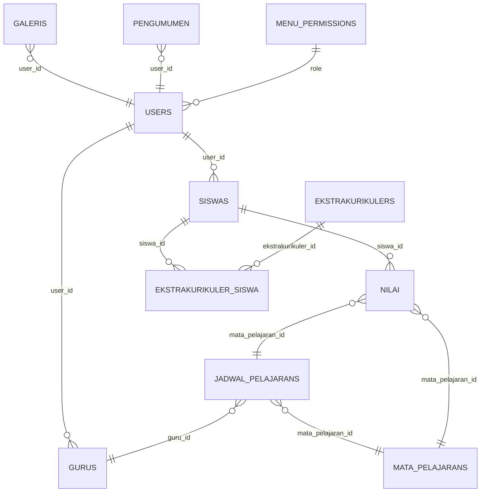

# Relasi Database EduTrack



**Penjelasan singkat:**
- **users**: Menyimpan data user (admin, guru, siswa).
- **siswas**: Data siswa, relasi ke users.
- **gurus**: Data guru, relasi ke users.
- **mata_pelajarans**: Data mata pelajaran.
- **jadwal_pelajarans**: Jadwal, relasi ke guru dan mata pelajaran.
- **nilais**: Data nilai, relasi ke siswa dan mata pelajaran.
- **ekstrakurikulers**: Data ekstrakurikuler.
- **ekstrakurikuler_siswa**: Pivot table siswa-ekstrakurikuler.
- **galeris**: Galeri foto, relasi ke user.
- **pengumumen**: Pengumuman, relasi ke user.
- **menu_permissions**: Hak akses menu berdasarkan role.

## Relasi yang Sudah Ada

### 1. User ↔ Siswa (One-to-One)
- **User** memiliki satu **Siswa** (`hasOne`)
- **Siswa** dimiliki oleh satu **User** (`belongsTo`)
- **Tabel Pivot**: Tidak ada (relasi langsung)

### 2. Nilai ↔ Siswa (Many-to-One)
- **Nilai** dimiliki oleh satu **Siswa** (`belongsTo`)
- **Siswa** memiliki banyak **Nilai** (`hasMany`)
- **Tabel Pivot**: Tidak ada (foreign key di tabel nilai)

### 3. Nilai ↔ MataPelajaran (Many-to-One)
- **Nilai** dimiliki oleh satu **MataPelajaran** (`belongsTo`)
- **MataPelajaran** memiliki banyak **Nilai** (`hasMany`)
- **Tabel Pivot**: Tidak ada (foreign key di tabel nilai)

### 4. Pengumuman ↔ User (Many-to-One)
- **Pengumuman** dimiliki oleh satu **User** (`belongsTo`)
- **User** memiliki banyak **Pengumuman** (`hasMany`)
- **Tabel Pivot**: Tidak ada (foreign key di tabel pengumuman)

## Relasi Many-to-Many yang Baru Ditambahkan

### 5. Siswa ↔ Ekstrakurikuler (Many-to-Many)
- **Siswa** dapat mengikuti banyak **Ekstrakurikuler**
- **Ekstrakurikuler** dapat diikuti oleh banyak **Siswa**
- **Tabel Pivot**: `ekstrakurikuler_siswa`

#### Struktur Tabel Pivot:
```sql
CREATE TABLE ekstrakurikuler_siswa (
    id BIGINT PRIMARY KEY AUTO_INCREMENT,
    ekstrakurikuler_id BIGINT,
    siswa_id BIGINT,
    created_at TIMESTAMP,
    updated_at TIMESTAMP,
    UNIQUE KEY unique_ekstrakurikuler_siswa (ekstrakurikuler_id, siswa_id),
    FOREIGN KEY (ekstrakurikuler_id) REFERENCES ekstrakurikulers(id) ON DELETE CASCADE,
    FOREIGN KEY (siswa_id) REFERENCES siswas(id) ON DELETE CASCADE
);
```

#### Method yang Tersedia:

**Di Model Siswa:**
```php
// Mendapatkan semua ekstrakurikuler siswa
$siswa->ekstrakurikuler

// Menambahkan ekstrakurikuler ke siswa
$siswa->ekstrakurikuler()->attach($ekstrakurikuler_id);

// Menghapus ekstrakurikuler dari siswa
$siswa->ekstrakurikuler()->detach($ekstrakurikuler_id);

// Sync ekstrakurikuler (replace semua)
$siswa->ekstrakurikuler()->sync([1, 2, 3]);
```

**Di Model Ekstrakurikuler:**
```php
// Mendapatkan semua siswa dalam ekstrakurikuler
$ekstrakurikuler->siswa

// Menambahkan siswa ke ekstrakurikuler
$ekstrakurikuler->siswa()->attach($siswa_id);

// Menghapus siswa dari ekstrakurikuler
$ekstrakurikuler->siswa()->detach($siswa_id);
```

## Routes yang Tersedia

### Ekstrakurikuler Management:
- `GET /ekstrakurikuler/{ekstrakurikuler}/siswa` - Lihat daftar siswa dalam ekstrakurikuler
- `POST /ekstrakurikuler/{ekstrakurikuler}/add-siswa` - Tambah siswa ke ekstrakurikuler
- `POST /ekstrakurikuler/{ekstrakurikuler}/remove-siswa` - Hapus siswa dari ekstrakurikuler

### Siswa Management:
- `GET /siswa/{siswa}/ekstrakurikuler` - Lihat daftar ekstrakurikuler siswa
- `POST /siswa/{siswa}/add-ekstrakurikuler` - Tambah ekstrakurikuler ke siswa
- `POST /siswa/{siswa}/remove-ekstrakurikuler` - Hapus ekstrakurikuler dari siswa

## Contoh Penggunaan

### 1. Menampilkan Ekstrakurikuler dengan Jumlah Siswa:
```php
$ekstrakurikulers = Ekstrakurikuler::with('siswa')->get();
foreach($ekstrakurikulers as $ekstrakurikuler) {
    echo $ekstrakurikuler->nama . ': ' . $ekstrakurikuler->siswa->count() . ' siswa';
}
```

### 2. Menampilkan Siswa dengan Ekstrakurikuler:
```php
$siswas = Siswa::with('ekstrakurikuler')->get();
foreach($siswas as $siswa) {
    echo $siswa->nama . ' mengikuti: ';
    foreach($siswa->ekstrakurikuler as $ekstrakurikuler) {
        echo $ekstrakurikuler->nama . ', ';
    }
}
```

### 3. Menambahkan Siswa ke Ekstrakurikuler:
```php
$ekstrakurikuler = Ekstrakurikuler::find(1);
$siswa = Siswa::find(1);
$ekstrakurikuler->siswa()->attach($siswa->id);
```

### 4. Menghapus Siswa dari Ekstrakurikuler:
```php
$ekstrakurikuler = Ekstrakurikuler::find(1);
$siswa = Siswa::find(1);
$ekstrakurikuler->siswa()->detach($siswa->id);
```

## Keuntungan Relasi Many-to-Many

1. **Fleksibilitas**: Satu siswa dapat mengikuti banyak ekstrakurikuler
2. **Skalabilitas**: Mudah menambah/menghapus relasi tanpa mengubah struktur data
3. **Integritas Data**: Foreign key constraints memastikan data konsisten
4. **Query Efisien**: Dapat menggunakan eager loading untuk mengurangi N+1 queries
5. **Audit Trail**: Timestamp di tabel pivot untuk tracking perubahan

## Migration yang Diperlukan

Jalankan migration untuk membuat tabel pivot:
```bash
php artisan migrate
```

Migration file: `2025_06_28_060730_create_ekstrakurikuler_siswa_table.php` 